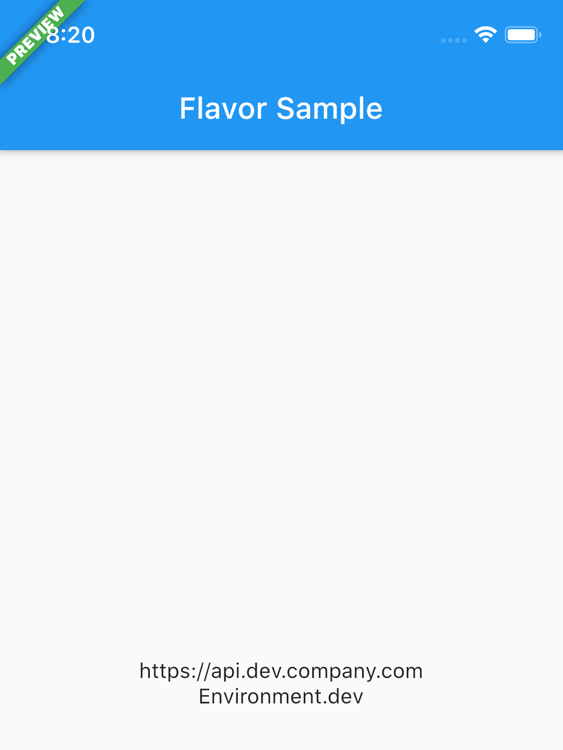
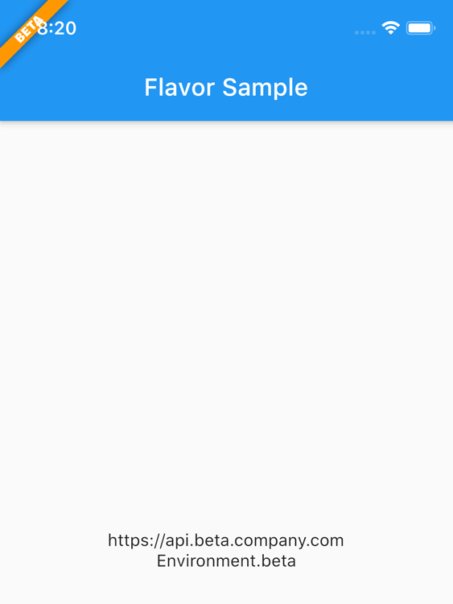
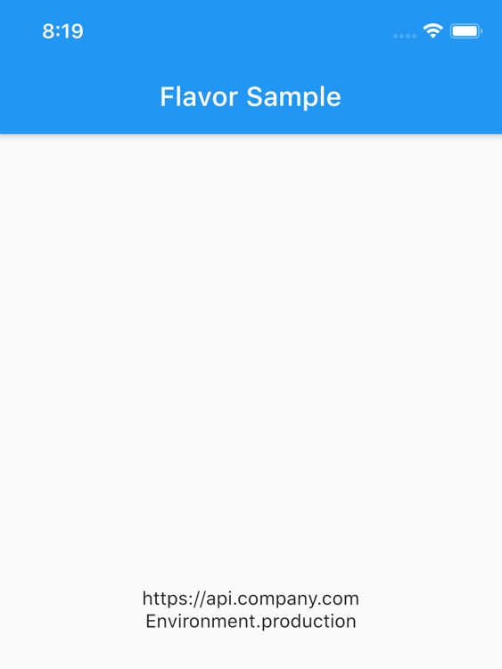

# flavor

[](https://pub.dartlang.org/packages/flavor)

A Flutter plugin for configuring flavor settings and optionally display a flavor banner on the app.

## Flavors

Each app needs some kind of flavor during its development lifecycle. You often have an api you use that is
different during dev, beta, production, or log settings for example. That's when flavors come in.

### Setup flavors

You can define different start `main` methods, each can be configured with a flavor.

So for example, you can create a `main_dev.dart` file for your development environment:

``` dart
void main() {
  Flavor.create(
    Environment.dev,
    color: Colors.green,
    name: 'PREVIEW',
    properties: {
      Keys.apiUrl: 'https://api.dev.company.com',
      Keys.apiKey: 'jksdhfkjhs83rjkh324kj23h4',
      logLevelKey: 100,
    },
  );
  setupApp();
}
```

And a `main_prod.dart` file for your production environment:

``` dart
void main() {
  Flavor.create(
    Environment.production,
    properties: {
      Keys.apiUrl: 'https://api.company.com',
      Keys.apiKey: 'lksdhjfkjhdsf8sdfjkhsdf896',
      logLevelKey: 5,
    },
  );
  setupApp();
}
```

Each of these files will point to another `main.dart` file:

``` dart
void setupApp() {
  final logLevel = Flavor.I.getInt(logLevelKey);
  print('LogLevel set for this flavor: $logLevel');
  runApp(FlavorApp());
}
```

### How does it look?

|               DEV               |               BETA               |               PROD               |
| :-----------------------------: | :------------------------------: | :------------------------------: |
|  |  |  |

**Note** that in the `PROD` flavor no flavor banner is showed.

### launch.json

In Visual Code you can define following to use the different flavors:

``` 
{
	"version": "0.2.0",
	"configurations": [
		{
			"name": "DEV",
			"request": "launch",
			"type": "dart",
			"program": "example/lib/main_dev.dart",
			// "args": [
			// 	"--flavor",
			// 	"dev"
			// ]
		},
		{
			"name": "BETA",
			"request": "launch",
			"type": "dart",
			"program": "example/lib/main_beta.dart",
			// "args": [
			// 	"--flavor",
			// 	"beta"
			// ]
		},
		{
			"name": "PRD",
			"request": "launch",
			"type": "dart",
			"program": "example/lib/main_prod.dart",
			// "args": [
			// 	"--flavor",
			// 	"prod"
			// ]
		},
	]
}
```

**Note**: The `args` keys are currently commented. These only works if you created the flavors in the iOS / Android native projects too.

### Extras

You can also define additional **properties** for each flavor/configuration. This is handy to store url's, api keys, etc.
Further in your app you can access these values.

``` dart
Flavor.I.getString(Keys.apiUrl)
```

The package has some default `Keys` at the moment which will be extended over time.
The defaults:
`apiUrl`, `apiKey`, `appTitle`

Of course you can add custom keys yourself as showed in the **example**.

Or you can check what flavor is currently running:

``` dart
if (Flavor.I.isDevelopment) {
// do something nice in development
}
```

Checkout the **example** folder for a complete setup.

## Flavorize your bundleids and assets

If you want to change bundle ids, or even assets (icon, splash screen) check out [flutter_flavorizr](https://pub.dev/packages/flutter_flavorizr). This nice tool will help you create flavors in Android and iOS.


## API Documentation

API documentation can be found [here](https://pub.dev/documentation/flavor/latest/)
